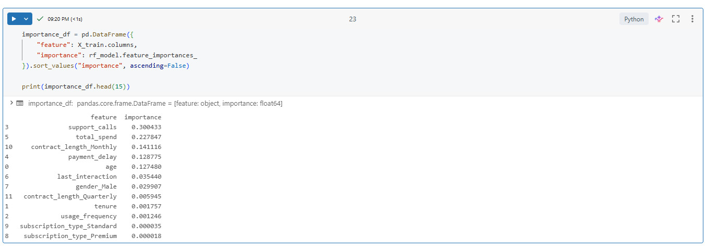

# databricks-customer-churn-project

## Tools Used
- Databricks Free Edition
- Python
- PySpark
- SQL
- Pandas
- Scikit-learn
- MLflow

## Dataset
The project uses separate training and testing customer churn datasets with the following fields:
- CustomerID
- Age
- Gender
- Tenure
- Usage Frequency
- Support Calls
- Payment Delay
- Subscription Type
- Contract Length
- Total Spend
- Last Interaction
- Churn

## Workflow
1. Read training and testing tables from Databricks Catalog
2. Clean and standardize column names and data types
3. Handle missing values
4. Save cleaned train and test tables
5. Build a combined table for SQL analysis
6. Analyze churn patterns using SQL
7. Train and evaluate Logistic Regression and Random Forest models
8. Generate churn probability predictions on the test data
9. Save predictions back into Databricks
10. Build dashboard views for business-facing insights

## Key Business Questions
- Which customer segments have the highest churn rates?
- Does churn differ by subscription type or contract length?
- Are payment delays and support calls associated with churn?
- Which customers appear to be highest risk based on model predictions?

## Modeling
Two classification models were used:
- Logistic Regression as a baseline
- Random Forest for a stronger nonlinear benchmark
Evaluation metrics included:
- Accuracy
- Precision
- Recall
- F1 Score
- ROC AUC

## Results
The Random Forest model outperformed the Logistic Regression baseline on the test set and was used to generate churn probabilities. Feature importance analysis suggested that variables such as payment delay, support calls, tenure, and usage behavior were among the strongest churn indicators.

## Screenshots
### Churn Analysis by Subscription Type

### Feature Importance

### Dashboard
Link to Data Visualization: https://dbc-f230962f-2b09.cloud.databricks.com/dashboardsv3/01f136df23301e089bf933ab0d0bacd8/published?o=7474658483866240&f_c94607fc%7Eb0883b89=%257B%2522columns%2522%253A%255B%2522color%2522%252C%2522x%2522%252C%2522y%2522%255D%252C%2522rows%2522%253A%255B%255B%2522Basic%2522%252C%2522Basic%2522%252C%252257.49%2522%255D%255D%257D

